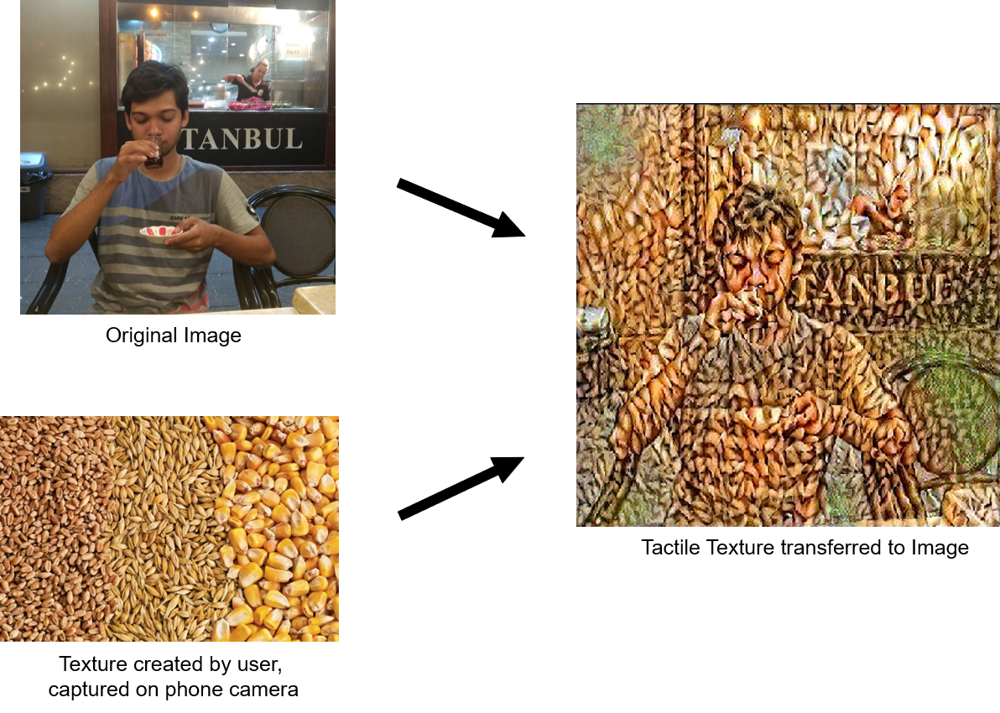

# tactile-texture-transfer
Transferring real textures made by users onto digital images using neural style transfer.

## Requirements
> Tensorflow

> Keras

> OpenCV

> Numpy

> Matplotlib

## Usage

1. Install the IP Webcam app from the Google Play Store on your mobile device.

2. Start a webcam server on the application.

3. Run ```python3 ttt.py -p PATH_TO_INPUT_IMAGE -i IP_ADDRESS_OF_MOBILE_SERVER:PORT```

## Results

The image below shows an example implementation, where a user creates a texture using grains, and transfers this to an input image.

<p align="center">
   
</p>

